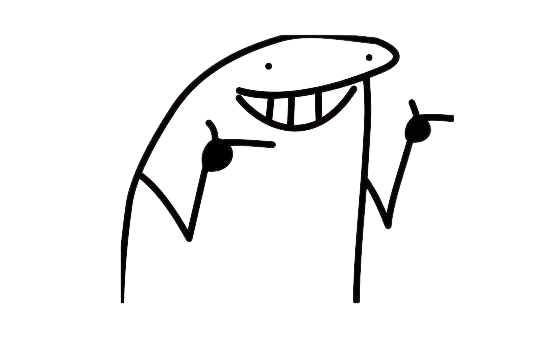

# Project Portfolio Assignment

  

This repository contains my submission for Assignment 3 - Project Portfolio. The objective of this assignment is to create a unique one-page project portfolio using HTML/CSS initially, with the option to convert it into React or any other preferred technology/framework later.

## Table of Contents

- [Design Inspiration](#design-inspiration)
- [Implementation](#implementation)
- [Timeline](#timeline)
- [Requirements](#requirements)
- [Conversion to Other Technology/Framework](#conversion-to-other-technologyframework)

## Design Inspiration

To create my project portfolio, I explored various design platforms like Behance, Dribbble, and Pinterest to find design inspirations. After careful consideration, I found a design that appealed to me and shared it with my supervisor for approval. [Here's](https://www.figma.com/file/GweoDyXmAIZMv2o06MIiYQ/Portfolio-UI---Web-%26-Mobile-(Community)?node-id=6%3A52&mode=dev) the design I chose to go with.

## Implementation

Based on the approved design, I have started working on the HTML/CSS implementation of my project portfolio. I will be utilizing my HTML/CSS skills to develop the initial version of the portfolio.

## Timeline

I have a total of two weeks to complete this assignment. By the end of next week, I will have a one-on-one session with my supervisor to review the progress I have made with the HTML/CSS design.

## Requirements

The requirements for this portfolio are the same as those provided in [Assignment 2](https://github.com/mr-vance/secondProject). I will ensure that all the specified requirements are met in my project portfolio.

## Conversion to Other Technology/Framework

While the initial implementation will be in HTML/CSS, I have the flexibility to later convert my design into React or any other technology/framework of my preference. This will allow me to demonstrate my skills in different technologies and explore the possibilities of enhancing the project portfolio further.

